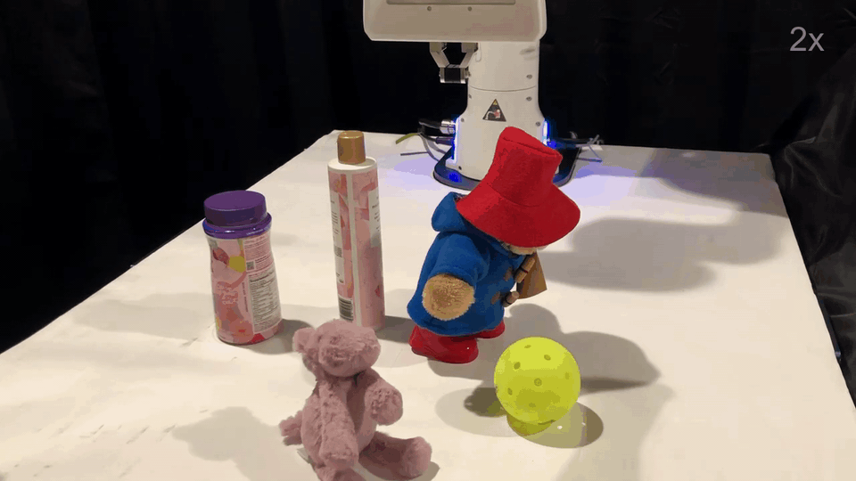

<h1 align="center">IMPACT: Intelligent Motion Planning with Acceptable Contact Trajectories via Vision-Language Models
</h1>


<p align="center">
    <a href="https://yiyang0207.github.io/"><strong>Yiyang Ling<sup>*</sup></strong></a>
    |
    <a href="https://www.linkedin.com/in/karan-owalekar/"><strong>Karan Owalekar<sup>*</sup></strong></a>
    |
    <a href="https://www.linkedin.com/in/oluwatobilobaadesanya"><strong>Oluwatobiloba Adesanya</strong></a>
    |
    <a href="https://ebiyik.github.io/"><strong>Erdem Bıyık</strong></a>
    |
    <a href="https://danielseita.github.io/"><strong>Daniel Seita</strong></a>
    <br>
    University of Southern California
    <br>
    * Equal Contribution
    <h3 align="center"><strong>International Conference on Robotics and Automation (ICRA), 2026</strong></h3>
</p>

<p align="center">
    <a href="https://impact-planning.github.io/"></a>
    <a href="https://arxiv.org/pdf/2503.10110"></a>
</p>

<p align="center">
    
</p>


## Installation

   ```bash
    conda create -n impact python=3.10 -y
    conda activate impact
    pip install -r requirements.txt
   ```


## Getting Started

To plan a trajectory in the given scene, run the following command:
```bash
python impact_planning.py --scene <SCENE_NAME> --algo <ALGORITHM_NAME>
```
We provide 20 simulation scenes in `assets/scenes/`, and `<ALGORITHM_NAME>` with the name of the motion planning algorithm you want to use (`a_star`, `a_star_plain` (a star w/o direction), `rrt`, `rrt_star`).

To evaluate and visualize the planned trajectory, run:
```bash
python execute_path.py --scene <SCENE_NAME> --algo <ALGORITHM_NAME>
```


## Citation
If you find this work useful, please consider citing:
```
@article{ling2025impact,
  title={Impact: Intelligent motion planning with acceptable contact trajectories via vision-language models},
  author={Ling, Yiyang and Owalekar, Karan and Adesanya, Oluwatobiloba and B{\i}y{\i}k, Erdem and Seita, Daniel},
  journal={arXiv preprint arXiv:2503.10110},
  year={2025}
}
```
